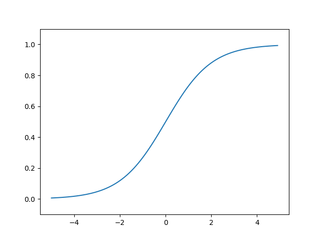

# 퍼셉트론에서 신경망으로

## 활성화 함수

입력 신호의 총합을 출력 신호로 변환하는 함수.  
입력 신호의 총합이 활성화를 일으키는지 정하는 역할을 한다.

```
a = b + w1x1 + w2x2 // 가중치가 곱해진 입력 신호의 총합
y = h(a) // 활성화 함수에 입력


활성화 함수는 임계값을 경계로 출력이 바뀌는데, 이런 함수를 계단 함수라 한다.
h(x) = 0 (x <= 0)
       1 (x > 0)
```

### 계단함수


### 시그모이드 함수

```
h(x) = 1 / 1 + exp(-x)
```


위의 계단 함수와는 '매끄러움'의 차이가 있다.  
시그모이드 함수는 부드러운 곡선이며 입력에 따라 출력이 연속적으로 변화한다.  
시그모이드 함수의 이 매끈함이 신경망 학습에서 아주 종요한 역할을 한다.

계단 함수가 0과 1 중 하나의 값만 돌려주었다면, 시그모이드 함수는 실수 값을 돌려준다.  
다시 말해 퍼셉트론에서는 뉴런 사이에 0 혹은 1이 흘렀다면, 신경망에서는 연속적인 실수가 흐른다.

### 비선형 함수

계단 함수와 시그모이드 함수의 공통점은 둘 모두 **비선형 함수**라는 것이다.  
신경망에서는 활성화 함수로 비선형 함수를 사용해야 한다.  
선형 함수를 이용하면 신경망의 층을 깊게 하는 의미가 없어지기 때문이다.

```
선형 함수를 사용한다면?

h(x) = cx 가 활성화 함수일 때,

y(x) = h(h(h(x)))
y(x) = c * c * c * x

결국 y(x) = ax 와 똑같은 식이 된다.

a = c^3
즉, 은닉층이 없는 네트워크로 표현할 수 있다.
선형 함수를 이용해서는 여러 층으로 구성하는 이점을 살릴 수 없다.
층을 쌓는 혜택을 얻고 싶다면 활성화 함수로 반드시 비선형 함수를 사용해야 한다.
```

### ReLU 함수

최근에는 시그모이드 함수보다 ReLU(Rectified Linear Unit) 함수를 주로 사용한다.

```
h(x) = x (x > 0)
       0 (x <= 0)
```


