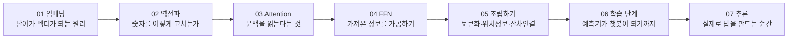

ChatGPT에게 무언가를 물어보면 그럴듯한 답이 돌아옵니다. 그런데 그 안에서는 정확히
무슨 일이 벌어지고 있을까요. "AI가 학습한다"는 말은 흔히 듣지만, **학습한다는 것이
구체적으로 어떤 숫자 계산을 뜻하는지**는 막상 설명하려면 막막합니다.

이 시리즈는 그 질문에 답하기 위해, 실제 LLM보다 훨씬 작은 **장난감 모델**을 만들어
숫자를 직접 손으로 계산해 봅니다. 어휘가 세 개뿐인 모델로 "고양이"라는 단어의 벡터가
학습 중에 어떻게 바뀌는지부터 시작해서, 마지막에는 Transformer 한 블록 전체와
ChatGPT가 대화를 하도록 다듬어지는 과정까지 이어집니다.

## 대상 독자

- 머신러닝을 전혀 몰라도 **LLM 내부에서 벌어지는 계산이 궁금한** 분
- "임베딩", "어텐션", "역전파" 같은 단어를 들어는 봤지만 **정확히 뭘 계산하는지는
  모르는** 분
- 미분이나 선형대수를 다시 공부하고 싶지는 않지만, 그 원리만큼은 이해하고 싶은 분

필요한 건 사칙연산과 약간의 호기심뿐입니다. 벡터의 내적(곱해서 더하기), 그리고
"이 숫자를 조금 바꾸면 결과가 얼마나 바뀔까"라는 미분의 감각 정도만 있으면
충분합니다. 모르셔도 괜찮습니다. 각 편에서 필요한 만큼 그때그때 설명합니다.

## 이 시리즈가 답하려는 질문 하나

시리즈 전체를 관통하는 질문은 이것 하나입니다.

> **"고양이"라는 단어의 벡터는 어떻게 정해지는가?**

처음에는 완전히 랜덤한 숫자로 시작합니다.

```text
고양이 → [0.2, 0.1]
```

이 숫자에는 처음에는 아무 의미가 없습니다. 그런데 학습이 끝나면 이 벡터는

```text
고양이 → [0.73, -0.21, 0.91, ...]
```

같은, "고양이"라는 단어의 의미와 다른 단어와의 관계를 담은 것처럼 보이는 숫자가
됩니다. **이 사이에 무슨 일이 있었는가**를 한 단계씩 따라가는 것이 이 시리즈의
전부입니다.

## 작은 모델로 보는 이유

실제 ChatGPT급 모델은 어휘가 수만~수십만 개, 벡터 차원이 수천, 층수가 수십~백
개에 이릅니다. 이 숫자로는 손 계산은커녕 머릿속으로 따라가기도 불가능합니다.

그래서 이 시리즈에서는 처음부터 끝까지 이런 극단적으로 작은 모델을 씁니다.

```text
어휘: 고양이, 강아지, 생선          (실제로는 수만~수십만 개)
임베딩 차원: 2차원                  (실제로는 수천 차원)
층 수: 1개                          (실제로는 수십~수백 개)
```

크기만 다를 뿐 **계산의 종류는 실제 LLM과 똑같습니다.** 2차원 벡터로 손 계산할 수
있는 내적, 미분, 역전파가 실제 모델에서는 수천 차원, 수십억 개의 파라미터에 대해
똑같은 방식으로, 다만 훨씬 많이 반복될 뿐입니다.

## 시리즈 목차



| 회차 | 다루는 내용 |
|------|-------------|
| [01. 단어가 숫자가 되는 곳](./01-embedding-basics.pub.md) | 임베딩 초기화부터, 학습으로 벡터가 바뀌는 과정을 숫자로 |
| [02. 얼마나, 어느 방향으로 바꿀까](./02-backpropagation.pub.md) | 미분 → Gradient → 역전파 → Gradient Descent |
| [03. 문장 속에서 서로에게 묻는다](./03-attention.pub.md) | Attention의 원리, Q/K/V, 멀티헤드, Causal Mask |
| [04. 가져온 정보를 혼자 처리하기](./04-feed-forward.pub.md) | FFN이 하는 일과 실제 구조 |
| [05. Transformer 한 블록 조립하기](./05-assembling-transformer.pub.md) | 토큰화, 위치 정보, 잔차 연결, LayerNorm |
| [06. 예측기는 어떻게 챗봇이 되는가](./06-pretraining-to-chatbot.pub.md) | 사전학습 → SFT → RLHF/DPO |
| [07. 모델이 답을 만드는 순간](./07-inference-and-decoding.pub.md) | 디코딩 전략과 KV 캐시 |

01~04편이 "학습이 무엇을 계산하는가"라는 핵심을 다지는 파트이고, 05~07편은 그
계산들이 실제 ChatGPT 같은 서비스가 되기까지 필요한 나머지 조각들입니다. 01~04편만
읽어도 "LLM이 학습한다"는 말의 실체는 확실히 잡힙니다.

다음 편에서는 실제로 임베딩이 숫자로 어떻게 초기화되고, 학습 한 번에 어떻게
바뀌는지를 손으로 계산해 봅니다.
