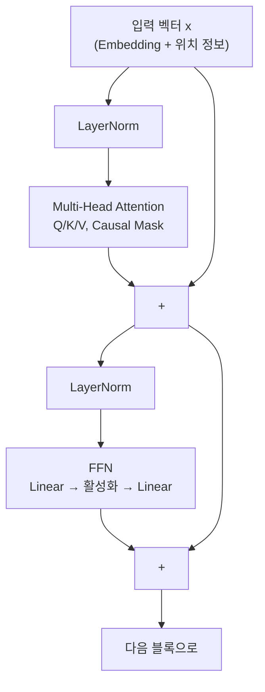

지금까지 세 편에 걸쳐 이런 그림을 그렸습니다.

```text
Embedding → Attention → FFN → 다음 토큰 확률
```

이 그림은 원리를 이해하기 위한 최소한의 뼈대였습니다. 실제로 이 뼈대만으로
Transformer를 만들면 학습이 잘 안 되거나, 아예 문장의 순서조차 구별하지 못합니다.
이번 편에서는 지금까지 미뤄 뒀던 나머지 부품들을 채워 넣습니다.

## 1. 문장은 어떻게 토큰이 되는가

지금까지는 "고양이", "생선"이 이미 하나의 토큰이라고 그냥 가정했습니다. 실제로는
문장이 곧바로 단어 단위로 쪼개지지 않습니다. ChatGPT 같은 모델은 **BPE(Byte Pair
Encoding)** 계열 알고리즘으로 미리 만들어 둔 수만~십만 개 규모의 **서브워드
(subword)** 사전을 씁니다.

```text
"unbelievable" → ["un", "believ", "able"]
"파이썬은"      → ["파이", "썬", "은"]
```

자주 등장하는 문자 조합은 통째로 하나의 토큰이 되고, 낯선 단어나 오탈자는 더 잘게
쪼개져서 여러 토큰으로 표현됩니다. 이 덕분에 사전에 없는 단어를 만나도 "모르는
토큰"이라는 것 없이 항상 처리할 수 있습니다. 01편의 Embedding Matrix가 딱 3개의
행(고양이/강아지/생선)만 가졌던 것처럼, 실제 모델의 Embedding Matrix는 이 토크나이저가
정한 사전 크기만큼의 행을 갖습니다.

## 2. Attention은 순서를 모른다

03편에서 본 Attention 계산을 다시 떠올려 봅시다. Query와 Key를 내적하고, Softmax를
적용하고, Value를 가중합합니다. 이 계산 어디에도 "몇 번째 토큰인가"라는 정보는
들어있지 않습니다.

```text
"고양이가 생선을 먹었다"
"먹었다를 생선을 고양이가"
```

극단적으로 말해, Attention 계산만 놓고 보면 이 둘은 **같은 토큰 집합을 다른 순서로
나열한 것일 뿐**이라 계산 결과가 사실상 같습니다. 언어에서 순서는 뜻을 완전히
바꾸는데, 이대로면 모델은 순서를 구별하지 못합니다. 이를 Attention의 **순서
불변성(permutation invariance)** 이라고 부릅니다.

그래서 Embedding에 **위치 정보**를 더한 다음 Transformer에 넣습니다.

```text
Transformer에 들어가는 입력 = Embedding(토큰) + PositionalEncoding(위치)
```

방식은 여러 가지가 있습니다.

| 방식 | 아이디어 | 쓰는 곳 |
|------|----------|---------|
| Sinusoidal | 위치마다 주파수가 다른 sin/cos 값을 미리 계산해 더한다 | 최초의 Transformer(2017) |
| 학습된 위치 임베딩 | 위치 0, 1, 2, ...마다 학습되는 벡터를 따로 두고 더한다 | GPT-2/GPT-3 |
| RoPE | Query, Key 벡터를 위치에 비례한 각도만큼 회전시킨다 | LLaMA 등 최신 오픈소스 LLM 다수 |

셋 다 목적은 같습니다. "이 토큰이 몇 번째에 있는가"를 벡터 어딘가에 새겨 넣어서,
Attention이 순서를 구별할 수 있게 만드는 것입니다.

## 3. 층이 깊어지면 생기는 문제

GPT-3급 모델은 03~04편에서 본 "Attention → FFN" 블록을 수십~백 개 넘게 쌓습니다
(GPT-3는 96층). 전달 게임을 떠올려 보면 감이 옵니다. 한 사람이 메시지를 듣고,
다음 사람에게 전달하고, 또 그다음 사람에게 전달하고... 이 과정을 백 번 반복하면
맨 끝에 도착하는 메시지는 원래와 완전히 달라져 있을 수 있습니다.

역전파도 비슷한 문제를 겪습니다. Loss에서 시작한 Gradient가 96개 층을 거슬러
올라가는 동안, 층을 지날 때마다 값이 조금씩 작아지면 맨 앞쪽 층에 도착할 즈음에는
거의 0이 되어 버립니다. Gradient가 0에 가까우면 02편에서 본 Gradient Descent가
사실상 "아무것도 바꾸지 말라"는 신호와 같아져서, 그 층은 더 이상 학습되지
않습니다. 이를 **Gradient Vanishing(기울기 소실)** 이라고 부릅니다.

## 4. 잔차 연결: 원본을 같이 들고 간다

해결책은 뜻밖에 단순합니다. 각 층의 출력에 그 층의 **입력을 그대로 한 번 더**
더해 주는 것입니다. 이를 **잔차 연결(residual connection)** 이라고 합니다.

$$
x_{\text{out}} = x + \text{Sublayer}(x)
$$

전달 게임에 비유하면, 각 사람이 자기가 들은 대로 옮기는 것뿐 아니라 **원본
쪽지를 접어서 같이 들고 가는 것**과 같습니다. 중간의 누군가가 실수로 메시지를
완전히 잘못 전달해도, 원본 쪽지 덕분에 맨 끝까지 최소한의 정보는 살아남습니다.
역전파 때도 이 `+x` 경로를 통해 Gradient가 층을 건너뛰고 곧장 앞쪽까지 흐를 수
있는 지름길이 생깁니다.

## 5. LayerNorm: 값의 크기를 가지런히 하기

층을 여러 번 통과하다 보면 벡터의 값이 점점 아주 커지거나 작아질 수 있습니다.
값의 크기가 들쭉날쭉하면 학습이 불안정해집니다. **LayerNorm**은 토큰 하나의
벡터를 대상으로, 평균이 0이고 흩어진 정도(분산)가 1이 되도록 다시 조정한 뒤,
학습되는 두 숫자 $\gamma$(스케일), $\beta$(이동)로 살짝 다시 늘리고 옮깁니다.

$$
\text{LN}(x) = \gamma \cdot \frac{x - \mu}{\sqrt{\sigma^2 + \epsilon}} + \beta
$$

$\mu$는 그 벡터 값들의 평균, $\sigma^2$는 분산입니다. 이 정규화를 Attention과 FFN
앞에 하나씩 놓아서, 두 서브레이어에 들어가는 값이 항상 비슷한 크기 범위를
유지하도록 만듭니다.

## 6. 마지막 벡터를 토큰 점수로: LM Head

Transformer 여러 층을 다 통과한 최종 벡터는 여전히 단순한 숫자 배열입니다. 이걸
"어떤 토큰이 다음에 올 확률이 높은가"라는 점수로 바꿔주는 마지막 Linear 층이
**LM Head**입니다. 01편의 "예측기"가 바로 이 자리에 해당합니다.

흥미로운 점은, LM Head의 행렬 크기가 맨 처음 토큰을 벡터로 바꿔주던 Embedding
Matrix와 정확히 전치(가로세로를 뒤집은) 관계라는 것입니다. 그래서 많은 모델이
둘을 **같은 행렬로 공유**합니다(Weight Tying). "토큰 → 벡터"와 "벡터 → 토큰
점수"에 같은 표를 양방향으로 쓰는 셈인데, 파라미터 수를 크게 줄이면서 품질에도
도움이 된다고 알려져 있습니다.

## 7. 한 블록을 조립하면

지금까지 채운 조각을 전부 넣으면, Transformer 한 블록의 실제 데이터 흐름은
다음과 같습니다.



이 블록을 N번 통과한 뒤 최종 벡터가 LM Head를 거쳐 vocab 크기만큼의 점수가 되고,
Softmax를 거쳐 다음 토큰 확률이 됩니다.

## 정리

| 부품 | 없으면 생기는 문제 | 해결하는 방식 |
|------|---------------------|---------------|
| 토큰화 | 사전에 없는 단어를 처리할 수 없다 | 서브워드로 쪼개서 표현 |
| 위치 인코딩 | 단어 순서를 구별하지 못한다 | 위치 정보를 벡터에 더하거나 회전으로 반영 |
| 잔차 연결 | 층이 깊어지면 학습 신호가 사라진다 | 입력을 출력에 그대로 더한다 |
| LayerNorm | 값의 크기가 들쭉날쭉해져 학습이 불안정하다 | 토큰별로 값을 정규화한다 |
| Weight Tying | Embedding과 LM Head를 따로 학습해야 한다 | 같은 행렬을 양방향으로 공유한다 |

여기까지가 "Transformer 한 블록이 어떻게 다음 토큰을 예측하는가"의 전체 그림입니다.
01~05편에서 본 구조와 학습 방식(다음 토큰 예측 + 역전파)만 놓고 보면 한 가지 의문이
남습니다. 그렇게만 학습하면 그냥 "그럴듯하게 문장을 이어 쓰는 모델"이 될 뿐인데,
왜 ChatGPT는 질문에 대답하고 지시를 따를까요. 다음 편에서 그 답을 봅니다.
