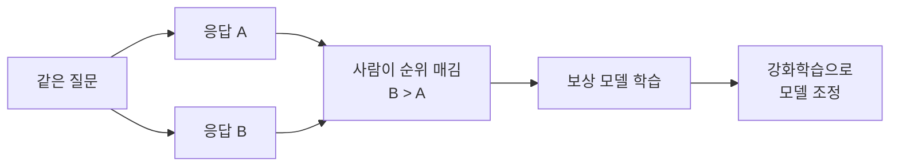
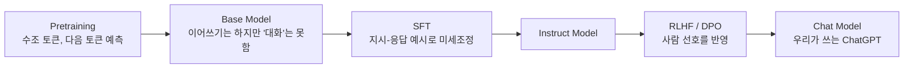

01~05편에서 본 학습 방식은 시종일관 하나였습니다. **문장의 일부를 보고, 다음
토큰을 맞히도록 임베딩과 Attention, FFN의 숫자를 조금씩 고치는 것.** 그런데
이상한 점이 하나 있습니다. 그렇게만 학습하면 "입력받은 텍스트와 비슷한 스타일로
이어 쓰는 모델"이 될 뿐인데, 왜 ChatGPT에게 "파이썬 리스트 정렬하는 법 알려줘"라고
물으면 진짜로 질문에 답을 해 줄까요. 이번 편에서 그 답을 봅니다.

## 1. Pretraining: 다음 토큰 맞히기, 아주 많이

01~05편에서 계속 본 학습이 바로 **Pretraining(사전학습)** 입니다. 인터넷 규모의
텍스트 — 위키백과, 뉴스, 책, 코드, 블로그 글 등 수조 개 토큰 — 에서 다음 토큰을
맞히도록 학습시킵니다.

이 단계만 거친 모델을 **Base Model**이라고 부릅니다. Base Model은 "질문에
답하기"보다 "입력받은 텍스트와 비슷한 스타일로 이어 쓰기"에 훨씬 가깝게
동작합니다. 예를 들어 Base Model에게

```text
파이썬 리스트를 정렬하는 방법을 알려줘.
```

라고 입력하면, 이 모델은 이걸 질문으로 인식하고 답을 하는 게 아니라 "이런 문장
다음에 자연스럽게 올 만한 텍스트"를 이어 씁니다. 인터넷에는 질문을 던지고 답하지
않은 채 비슷한 질문을 더 나열하는 텍스트(예: FAQ 목록, 시험 문제지)도 많기
때문에, 이런 식으로 이어질 수도 있습니다.

```text
파이썬 리스트를 정렬하는 방법을 알려줘.
파이썬 딕셔너리를 정렬하는 방법을 알려줘.
파이썬 튜플을 정렬하는 방법을 알려줘.
```

구조와 학습 목표(다음 토큰 예측)만 보면 Base Model도 지금까지 배운 내용과 완전히
같습니다. 다른 것은 **"질문을 받으면 도움이 되는 답으로 응답한다"는 대화 형식
자체를 아직 배우지 않았다**는 점입니다.

## 2. SFT: 대화하는 법을 가르치기

**SFT(Supervised Fine-Tuning, 지도 미세조정)** 는 Base Model에게 그 형식을
가르치는 단계입니다. 사람이 직접 만들거나 고른 "지시문 → 이상적인 응답" 쌍으로
다시 학습시킵니다.

```text
지시문: 파이썬 리스트를 정렬하는 방법을 알려줘.
이상적 응답: `sorted()` 함수나 `list.sort()` 메서드를 쓰면 됩니다.
            예를 들어 `sorted([3, 1, 2])`는 `[1, 2, 3]`을 반환합니다...
```

학습 방식은 01~02편에서 본 것과 똑같습니다. 예측 → 정답과 비교 → Loss → 역전파 →
가중치 수정. 다만 이번에는 "다음 문장을 그럴듯하게 잇는 것"이 아니라 "질문을
받으면 이렇게 답하는 것"이 정답 패턴이 되도록 데이터를 바꿔서 학습시킨 것입니다.
이 단계를 거친 모델을 **Instruct Model**이라고 부릅니다.

## 3. RLHF와 DPO: 더 나은 답을 고르는 법

SFT까지 마치면 모델은 질문에 그럴듯하게 답합니다. 그런데 "그럴듯한 답 여러 개
중에 어떤 게 더 나은 답인가"는 사람마다 판단이 다르고, 정답이 하나로 딱 정해지지
않는 경우가 많습니다. 예의 바른 톤인지, 위험한 내용을 담고 있진 않은지, 너무
장황하진 않은지 같은 기준은 "정답 문장"으로 가르치기가 어렵습니다.

**RLHF(Reinforcement Learning from Human Feedback)** 는 이 문제를 이렇게
풉니다.

1. 같은 질문에 대해 모델이 여러 개의 답을 만들어 냅니다.
2. 사람이 "이 답이 저 답보다 낫다"고 순위를 매깁니다.
3. 이 선호 데이터로 **보상 모델(Reward Model)** 을 따로 학습시킵니다. 어떤 답을
   넣으면 "얼마나 선호될 만한 답인가"를 점수로 매기는 모델입니다.
4. 이 보상 모델의 점수를 높이는 방향으로, 강화학습(대표적으로 PPO라는 알고리즘)을
   써서 Instruct Model을 다시 조정합니다.



**DPO(Direct Preference Optimization)** 는 더 단순한 대안입니다. 보상 모델을
따로 학습시키고 강화학습까지 돌리는 대신, "A보다 B가 낫다"는 선호 데이터에서
곧바로 모델을 조정합니다. 계산 비용과 학습 불안정성이 RLHF보다 적어서, 최근
공개되는 모델들은 DPO 계열을 많이 씁니다.

## 4. 전체를 한 줄로 이으면



| 단계 | 학습 데이터 | 배우는 것 |
|------|-------------|-----------|
| Pretraining | 인터넷 규모의 일반 텍스트 | 다음 토큰을 맞히는 기본 능력, 언어 패턴 |
| SFT | 사람이 만든 지시-응답 쌍 | "질문을 받으면 답으로 응답한다"는 대화 형식 |
| RLHF / DPO | 응답 간 사람의 선호 순위 | 더 도움이 되고, 안전하고, 자연스러운 답을 고르는 기준 |

즉 "다음 토큰을 예측한다"는 기본 계산 방식 자체는 세 단계 내내 크게 다르지
않습니다. 01~05편에서 배운 Embedding, Attention, FFN, 역전파가 세 단계 모두에서
똑같이 동작합니다. 바뀌는 것은 **어떤 데이터로 그 학습을 시키는가**입니다. 구조가
아니라 데이터와 단계가 그저 문장을 이어 쓰는 모델과 우리가 쓰는 챗봇을 가르는
지점입니다.

다음 편에서는 이렇게 학습이 끝난 모델이, 실제로 우리 눈앞에서 답을 만들어낼 때
— 즉 학습이 아니라 **추론(inference)** 시점 — 무슨 일이 일어나는지 봅니다.
