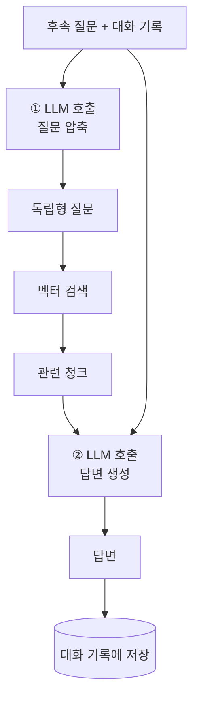

지금까지 만든 RAG는 **질문 하나에 답 하나**입니다. 실제 채팅에서는 이런 대화가 벌어지죠.

```text
사용자: ReAct 논문의 핵심 아이디어가 뭐야?
AI:    (설명)
사용자: 그거 한계는?
```

"그거 한계는?" — 이 문장을 그대로 임베딩해서 검색하면 어떻게 될까요?
**아무것도 못 찾습니다.** "그거"가 무엇인지 벡터는 알지 못하니까요.
대화형 RAG의 첫 번째 관문이 여기입니다.

## 1. 해결책: 질문 압축

방법은 단순합니다. 검색하기 **전에** 질문을 다시 씁니다.

> 대화 기록 + 후속 질문 → **혼자서도 이해 가능한 질문**(standalone question)

```text
[대화 기록]
Human: ReAct 논문의 핵심 아이디어가 뭐야?
AI: 추론과 행동을 번갈아 수행하는 프레임워크로...

[후속 질문] 그거 한계는?

        ↓ LLM으로 다시 쓰기

[독립형 질문] ReAct 프레임워크 접근법의 한계는 무엇인가?
```

이 문장이면 벡터 검색이 제대로 동작합니다.

전체 흐름은 이렇게 바뀝니다.



**LLM을 두 번 호출**한다는 점을 기억하세요. 지연과 비용이 두 배 가까이 됩니다.
그래서 압축용 LLM은 작고 빠른 모델을 쓰는 것이 좋습니다.

## 2. 코드로 만들기

LangChain에서는 압축과 검색을 `create_history_aware_retriever`가 담당합니다.

> 오래된 자료에는 이 흐름이 `ConversationalRetrievalChain` 하나로 묶여 있습니다.
> 지금은 **레거시**로 분류되어 있으니, 새로 만든다면 아래 조합을 쓰세요.
> 개념(압축 → 검색 → 생성)은 그대로입니다.

```python
from langchain.chains.history_aware_retriever import create_history_aware_retriever
from langchain.chains.combine_documents import create_stuff_documents_chain
from langchain.chains.retrieval import create_retrieval_chain
from langchain_core.prompts import ChatPromptTemplate, MessagesPlaceholder
from langchain_openai import ChatOpenAI

# ── ① 질문 압축용 프롬프트 ──────────────────────────────
condense_prompt = ChatPromptTemplate.from_messages([
    ("system",
     "아래 대화 기록과 후속 질문이 주어집니다. 후속 질문을 대화 기록 없이도 "
     "이해할 수 있는 독립적인 질문으로 다시 작성하세요. "
     "답하지 말고 질문만 출력하세요. 이미 독립적이면 그대로 두세요."),
    MessagesPlaceholder("chat_history"),
    ("human", "{input}"),
])

history_aware_retriever = create_history_aware_retriever(
    ChatOpenAI(model="gpt-4o-mini", temperature=0),   # 압축용: 작고 빠른 모델
    retriever,
    condense_prompt,
)

# ── ② 답변 생성용 프롬프트 ──────────────────────────────
answer_prompt = ChatPromptTemplate.from_messages([
    ("system", SYSTEM),          # 5편의 근거 제한 시스템 프롬프트 + {context}
    MessagesPlaceholder("chat_history"),
    ("human", "{input}"),
])

rag_chain = create_retrieval_chain(
    history_aware_retriever,
    create_stuff_documents_chain(
        ChatOpenAI(model="gpt-4o-mini", temperature=0), answer_prompt
    ),
)
```

`MessagesPlaceholder("chat_history")`는 "여기에 대화 기록 메시지들을 끼워 넣어라"는 자리 표시자입니다.

호출할 때는 기록을 함께 넘깁니다.

```python
from langchain_core.messages import HumanMessage, AIMessage

history = []
for question in ["ReAct의 핵심 아이디어가 뭐야?", "그거 한계는?"]:
    result = rag_chain.invoke({"input": question, "chat_history": history})
    print("Q:", question)
    print("A:", result["answer"], "\n")
    history.extend([HumanMessage(content=question),
                    AIMessage(content=result["answer"])])
```

> `create_history_aware_retriever`는 **대화 기록이 비어 있으면 압축을 건너뛰고** 질문을 그대로 검색합니다.
> 첫 질문에서 불필요한 LLM 호출이 일어나지 않도록 되어 있습니다.

압축용 LLM에는 **스트리밍을 켜지 마세요.** 압축 결과는 내부 처리용 문장이라
사용자에게 보이면 안 되는데, 스트리밍을 켜 두면 "ReAct 프레임워크 접근법의 한계는..." 같은
재작성 문장이 화면에 그대로 튀어나옵니다. 7편에서 이 함정을 자세히 뜯어봅니다.

## 3. 대화 기록을 어디에 둘 것인가

위 코드는 기록을 파이썬 리스트에 담았습니다. 스크립트로는 충분하지만 서비스로는 안 됩니다.

- 서버를 재시작하면 사라진다
- 워커가 여러 개면 요청마다 다른 프로세스에 도착한다
- 사용자가 어제 하던 대화를 이어갈 수 없다

그래서 **대화 기록은 애플리케이션 DB에 저장**합니다.

LangChain의 `BaseChatMessageHistory` 인터페이스를 직접 구현하면
저장소를 앱의 DB로 바꿀 수 있습니다.

```python
class SqlMessageHistory(BaseChatMessageHistory, BaseModel):
    conversation_id: str

    @property
    def messages(self):
        return get_messages_by_conversation_id(self.conversation_id)

    def add_message(self, message):
        return add_message_to_conversation(
            conversation_id=self.conversation_id,
            role=message.type,
            content=message.content,
        )

    def clear(self):
        pass
```

인터페이스가 `messages`(읽기)와 `add_message`(쓰기) 두 개뿐이라 구현이 어렵지 않습니다.
이렇게 하면 대화 메시지가 **앱의 `Message` 테이블**에 그대로 쌓입니다.
채팅 UI에서 과거 메시지를 보여 주는 쿼리와 LLM이 참조하는 기록이 **같은 데이터**가 되는 것이죠.
별도 저장소를 두면 둘이 어긋나는 순간 디버깅이 지옥이 됩니다.

### 조용히 품질을 망가뜨리는 버그: 정렬

`messages`를 구현할 때 반드시 **시간 오름차순**으로 돌려줘야 합니다.

```python
messages = (
    db.session.query(Message)
    .filter_by(conversation_id=conversation_id)
    .order_by(Message.created_on.asc())     # ← 반드시 asc
)
```

내림차순으로 주면 두 가지가 동시에 망가집니다.

1. 질문 압축 프롬프트에 대화가 **거꾸로** 들어가 문맥 해석이 틀어집니다.
2. 뒤에 나올 윈도우 전략이 "최근 k턴"이 아니라 "**가장 오래된 k턴**"을 집습니다.

에러가 나지 않고 답변만 조금씩 이상해지는 종류의 버그라, 발견이 늦습니다.
채팅 UI는 보통 최신 메시지를 먼저 가져오도록 짜기 때문에, 그 쿼리를 그대로 재사용하다가
쉽게 밟는 함정입니다. **LLM에 넘기는 기록은 별도로 오름차순 정렬**하세요.

### 최신 방식: RunnableWithMessageHistory

직접 구현하지 않고 기성품을 쓸 수도 있습니다.

```python
from langchain_core.runnables.history import RunnableWithMessageHistory
from langchain_community.chat_message_histories import SQLChatMessageHistory

def get_session_history(session_id: str):
    # 버전에 따라 connection 대신 connection_string 인자를 씁니다
    return SQLChatMessageHistory(session_id=session_id,
                                 connection="sqlite:///chat_history.db")

conversational_rag = RunnableWithMessageHistory(
    rag_chain,
    get_session_history,
    input_messages_key="input",
    history_messages_key="chat_history",
    output_messages_key="answer",
)

result = conversational_rag.invoke(
    {"input": "그거 한계는?"},
    config={"configurable": {"session_id": "conversation-123"}},
)
```

체인 호출 전후로 기록을 읽고 쓰는 일을 대신해 줍니다.
`session_id`가 대화 하나를 가리키는 키입니다(앱의 `conversation_id`에 해당).

**직접 구현 vs 기성품** 판단 기준은 이렇습니다.
메시지가 앱의 다른 기능(목록 조회, 검색, 관리자 화면)에도 쓰인다면
앱의 `Message` 테이블에 붙이는 편이 낫고, 대화 기록이 오직 LLM용이라면 기성품으로 충분합니다.

## 4. 메모리 전략: 기록을 얼마나 넣을 것인가

대화가 길어지면 기록 전체를 프롬프트에 넣을 수 없습니다. 선택지가 있습니다.

| 전략 | 동작 | 장점 | 단점 |
|------|------|------|------|
| **전체 버퍼** | 모든 기록을 넣음 | 문맥 손실 없음 | 길어지면 토큰 폭증 |
| **윈도우** | 최근 k턴만 | 저렴·빠름·예측 가능 | 오래된 맥락 손실 |
| **요약** | 오래된 기록을 요약해 압축 | 긴 대화에 강함 | 요약에 LLM 호출 추가, 정보 손실 |

**추천은 윈도우 전략(최근 3~5턴)에서 시작하는 것**입니다.
RAG에서 대화 기록의 주 용도는 "질문 압축을 위한 최근 문맥"이라, 아주 긴 기록이 필요한 경우가 드뭅니다.
비용과 지연이 예측 가능해진다는 것도 큰 장점입니다.

예전 LangChain에는 `ConversationBufferMemory`, `ConversationBufferWindowMemory` 같은
메모리 클래스가 있었지만 지금은 레거시입니다. 기록을 잘라 넘기는 일은 함수 하나로 충분합니다.

```python
def recent(messages, turns=4):
    return messages[-turns * 2:]     # 1턴 = 사용자 + AI 메시지 2개

result = rag_chain.invoke({
    "input": question,
    "chat_history": recent(history),
})
```

토큰 수 기준으로 자르고 싶다면 `trim_messages`를 쓰면 됩니다.

```python
from langchain_core.messages import trim_messages

trimmed = trim_messages(
    history,
    max_tokens=1500,
    token_counter=llm,        # 모델의 토크나이저로 계산
    strategy="last",          # 최근 메시지부터 채운다
    start_on="human",         # 사용자 메시지에서 시작하도록 경계를 맞춘다
)
```

## 5. 대화형 RAG에서 자주 겪는 문제

| 증상 | 원인 | 대응 |
|------|------|------|
| 후속 질문에서 검색이 빗나감 | 압축이 안 되거나 잘못됨 | 압축된 질문을 로그로 찍어 확인 |
| 압축 문장이 사용자에게 보임 | 압축 LLM이 스트리밍됨 | 압축용은 `streaming=False` (7편) |
| 대화가 길수록 느려짐 | 전체 버퍼 메모리 | 윈도우/요약으로 전환 |
| 이전 답변을 기억 못 함 | 기록이 저장/조회되지 않음 | `add_message`, 정렬, `session_id` 확인 |
| 주제가 바뀌었는데 옛 문맥이 섞임 | 압축이 과거에 끌려감 | 윈도우를 줄이거나 "새 대화" 버튼 제공 |

**압축된 질문을 로그로 남기는 것**이 대화형 RAG 디버깅의 핵심입니다.

```python
docs = history_aware_retriever.invoke({
    "input": "그거 한계는?",
    "chat_history": history,
})
for d in docs:
    print(d.metadata.get("page_label"), d.page_content[:80])
```

검색된 문서가 엉뚱하다면 압축 단계를 의심하세요. 압축 프롬프트를 조금 더 구체적으로
("문서 검색에 쓸 질의로 다시 쓰라") 바꾸는 것만으로 좋아지는 경우가 많습니다.
9편에서 다룰 트레이싱을 켜면 압축 결과를 매번 눈으로 확인할 수 있습니다.

## 실습

1. 3턴짜리 대화를 만들어, 압축 전 질문과 압축 후 질문을 나란히 출력해 보세요.
2. 윈도우 크기를 1, 3, 10으로 바꿔 가며 같은 대화를 반복하고 답변 품질과 응답 시간을 비교해 보세요.
3. `chat_history`를 일부러 역순으로 넣어 보세요. 어떤 답변이 나오나요?

다음 편은 **스트리밍**입니다. 답변이 한 번에 뚝 나오는 대신 토큰 단위로 흘러나오게 만들고,
그 과정에서 대화형 RAG가 반드시 마주치는 까다로운 함정 하나를 해부합니다.
